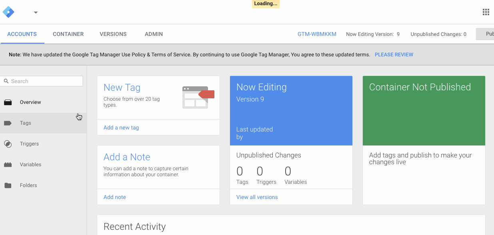

# UserPath Documentation
Our documentation - for the time being. If you have any questions, please don't hesitate to email support@userpath.co - we will get back to you as quickly as possible!

## Plugin Installation Instructions

These instructions guide you through setup for our most common platforms as well as plain HTML setup. If we're missing a platform, please email us at support@userpath.co. The other thing is that if you want to contribute to these docs, feel free to make a pull request, we will review it. 

Also, remember: You must drop the URL of your tumblr blog into your allowed domains in the widget configuration.

### On Google Tag Manager

------
1. Go to the container you'd like to add the plugin to
2. Click "Add new tag"
3. Click "Custom HTML Tag"
4. Paste in your UserPath code
5. Check the "Support document.write" option
6. Click continue
7. Select "All Pages"
8. Click "Create Tag"

__GIF Walkthrough:__ 

### On Tumblr

------

1. Go to the profile icon in the top right
2. Click on the Tumblr you want to add the UserPath plugin to
3. Click "edit appearance"
4. Click "edit theme"
5. At the top on the left click on the tiny "Edit HTML" link
6. Scroll to bottom of code
7. Paste in your UserPath code

__REMEMBER:__ You must drop the URL of your tumblr blog into your allowed domains in the widget configuration.

__GIF Walkthrough:__ 

### On WordPress

------
1. Sign in to your WordPress installation
2. On the left hand menu hover over "Appearance"
3. Then click "Widgets"
4. Make sure you have a "Text" widget available in your available widget area (most common is sidebar) or add one
5. Enter "UserPath plugin" as the title
6. Paste your UserPath code into the "Content" box
7. Click the "save" button

__GIF Walkthrough:__ 

### On Shopify

------
fdsfs

### On Magento

------
fdsfs

### On BigCommerce

------
fdsfs

### On 3DCart

------
fdsfs

### On PrestaShop

------
fdsfs

### On Weebly

------
fdsfs

### On SquareSpace

------
fdsfs

### Using Plain HTML

------
1. Open your text editor of choice
2. Paste your UserPath code on every page or if using a template engine, just drop it in the master layout
3. It should go right before the `</body>` end tag.

__GIF Walkthrough:__ 

## App Download Plugin Installation

If you're trying to use the `drop-in` layout so you can place the app download form where ever you  want on your page, then you must place the snippet provided to you in the HTML, like so:

```html
<!-- begin UserPath embed code -->
<script type="text/javascript" src="//alpha.userpath.co/w/get/ability.js"></script>
<!-- end UserPath embed code -->
<div class="userpath-plug-f4a1aedz66"></div> <!-- place this where you want the form to show up -->
```

If you'd like to place the form in more than one place on the same page, simply copy the line with the div tag and place it multiple times in your HTML where ever you would like it to appear. For instance, say you have a `header`, a `main section`, a `download section` and `footer`. Let's say you want to have your App Download widget in the `header` and the `download section` and this is your HTML:

```html
<!DOCTYPE html>
<html>
<head>
	<title>My App Homepage</title>
</head>
<body>
	<header>
		<button>Download for iOS</button>
		<button>Download for Android</button>
	</header>
	<section id="main">
		<ul>
			<li>It's free</li>
			<li>It's live streaming</li>
			<li>It's social</li>
			<li>It's local</li>
			<li>It's viral</li>
			<li>It's gamified</li>
		</ul>
	</section>
	<section id="download">
		<button>Download for iOS</button>
		<button>Download for Android</button>
	</section>
	<footer>
		<p>&copy; 2016 My App Homepage</p>
		<a href="#">about</a>
		<a href="#">contact</a>
	</footer>
</body>
</html>
```

You would simply add the `script` tag to the bottom, like so:

```html
<!DOCTYPE html>
<html>
<head>
	<title>My App Homepage</title>
</head>
<body>
	... <!-- your code above this -->
	<!-- begin UserPath embed code -->
	<script type="text/javascript" src="//app.userpath.co/w/get/f4a1aedz66.js"></script>
	<!-- end UserPath embed code -->
</body>
</html>
```

and finally, drop the `div`s in the appropriate sections (`header` and `download`) like this:

```html
<!DOCTYPE html>
<html>
<head>
	<title>My App Homepage</title>
</head>
<body>
	<header>
		...
		<div class="userpath-plug-f4a1aedz66"></div> <!-- place this where you want the form to show up -->
	</header>
	<section id="main">
		<ul>
			...
		</ul>
	</section>
	<section id="download">
		<div class="userpath-plug-f4a1aedz66"></div> <!-- place this where you want the form to show up -->
		...
	</section>
	<footer>
		...
	</footer>
	<!-- begin UserPath embed code -->
	<script type="text/javascript" src="//app.userpath.co/w/get/f4a1aedz66.js"></script>
	<!-- end UserPath embed code -->
</body>
</html>
```
